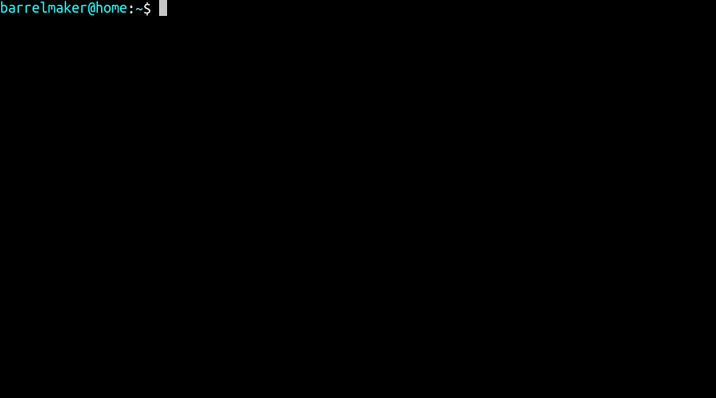

# Personal Helm Chart Library for Kubernetes

Applications I use, ready to launch on Kubernetes using [Kubernetes Helm](https://github.com/helm/helm).

## TL;DR

```bash
helm repo add barrelmaker https://charts.barrelmaker.dev
helm search repo barrelmaker
helm install my-release barrelmaker/<chart>
```



## Before you begin

### Prerequisites
- Kubernetes 1.12+
- Helm 3.1.0

### Setup a Kubernetes Cluster

For setting up Kubernetes on other cloud platforms or bare-metal servers refer to the Kubernetes [getting started guide](http://kubernetes.io/docs/getting-started-guides/).

### Install Helm

Helm is a tool for managing Kubernetes charts. Charts are packages of pre-configured Kubernetes resources.

To install Helm, refer to the [Helm install guide](https://github.com/helm/helm#install) and ensure that the `helm` binary is in the `PATH` of your shell.

### Add Repo

The following command allows you to download and install all the charts from this repository:

```bash
helm repo add barrelmaker https://charts.barrelmaker.dev
```

### Using Helm

Once you have installed the Helm client, you can deploy a Helm Chart into a Kubernetes cluster.

Please refer to the [Quick Start guide](https://helm.sh/docs/intro/quickstart/) if you wish to get running in just a few commands, otherwise the [Using Helm Guide](https://helm.sh/docs/intro/using_helm/) provides detailed instructions on how to use the Helm client to manage packages on your Kubernetes cluster.

Useful Helm Client Commands:
* View available charts: `helm search repo`
* Install a chart: `helm install my-release barrelmaker/<package-name>`
* Upgrade your application: `helm upgrade`

## Security defaults

Every chart meets the [restricted Pod Security Standard](https://kubernetes.io/docs/concepts/security/pod-security-standards/#restricted)
out of the box: pods run as a non-root user (the image's own where it has
one), cannot gain privileges, drop all Linux capabilities, use the runtime's
default seccomp profile, and do not mount a service account token.

These are ordinary values (`podSecurityContext`, `securityContext`,
`serviceAccount.automount`, and the same settings on sidecars such as
`gitSync`), and Helm merges yours into them. Set a key to change it, or set it
to `null` to drop it:

```yaml
podSecurityContext:
  runAsUser: 1234        # a different user
securityContext:
  capabilities: null     # keep the image's default capabilities
```

Obscura's bundled RustFS and Valkey subcharts ship `helm test` pods without a
security context, so `helm test` fails in a namespace that enforces the
restricted standard. Installs and upgrades are not affected.

# License

Copyright (c) 2026 Nolan Cooper

This chart collection is free software: you can redistribute it and/or modify
it under the terms of the GNU General Public License as published by
the Free Software Foundation, either version 3 of the License, or
(at your option) any later version.

This chart collection is distributed in the hope that it will be useful,
but WITHOUT ANY WARRANTY; without even the implied warranty of
MERCHANTABILITY or FITNESS FOR A PARTICULAR PURPOSE.  See the
GNU General Public License for more details.

You should have received a copy of the GNU General Public License
along with this chart collection.  If not, see <https://www.gnu.org/licenses/>.
